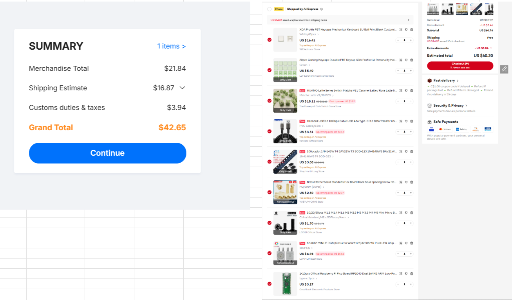
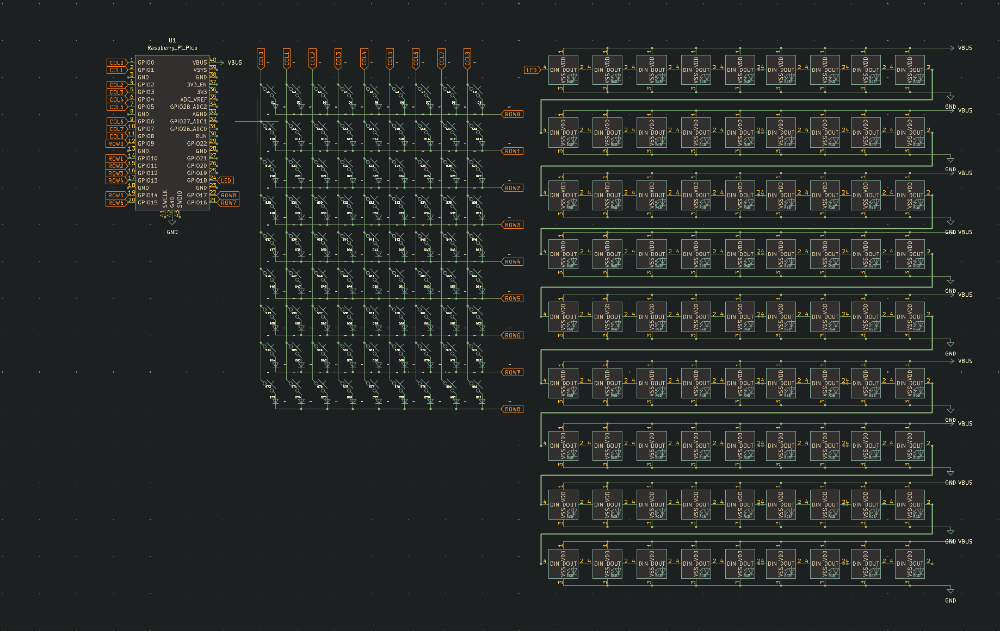
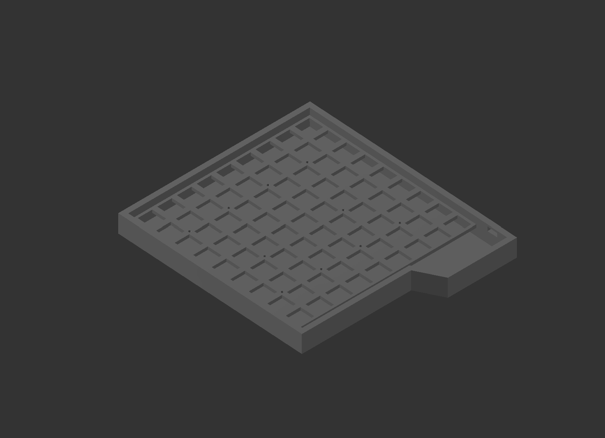
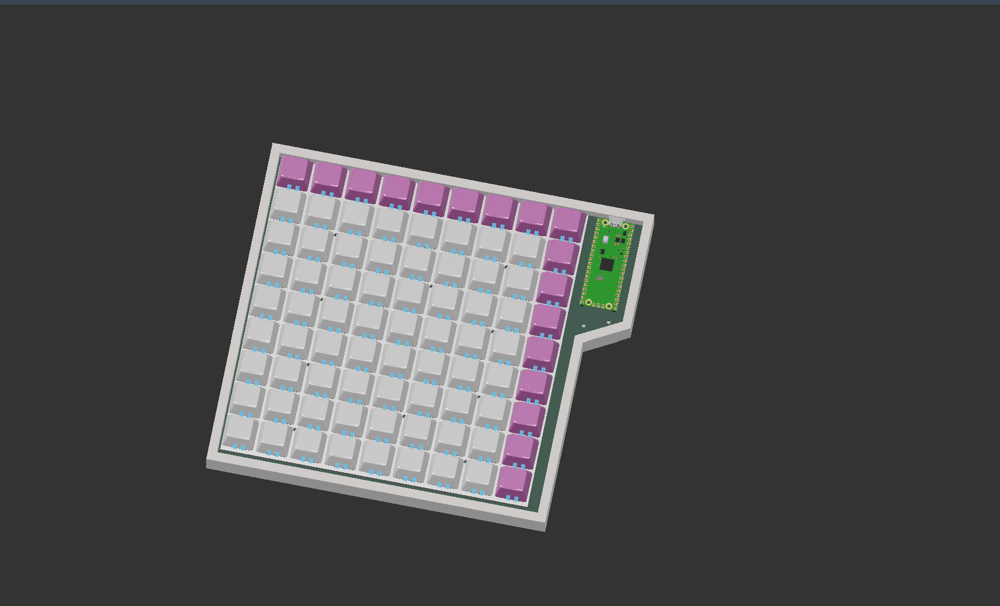
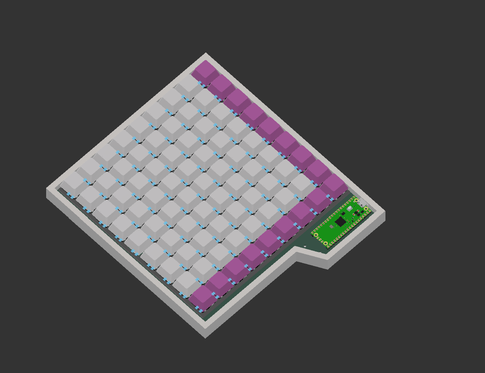

# Pepuino Pad

This is the pepuino pad, a 9 by 9 midi launchpad, with per key rgb illumination (the brightness can only be set to 30% ish) the pepuino pad is a midi compatible launchpad to make music, this project, the shematics and the pcb are made in kicad, and the case and render are made in fusion 360

## BOM
 
###  Shematic
 
### pcb
 
### case
 
### render
 
 

