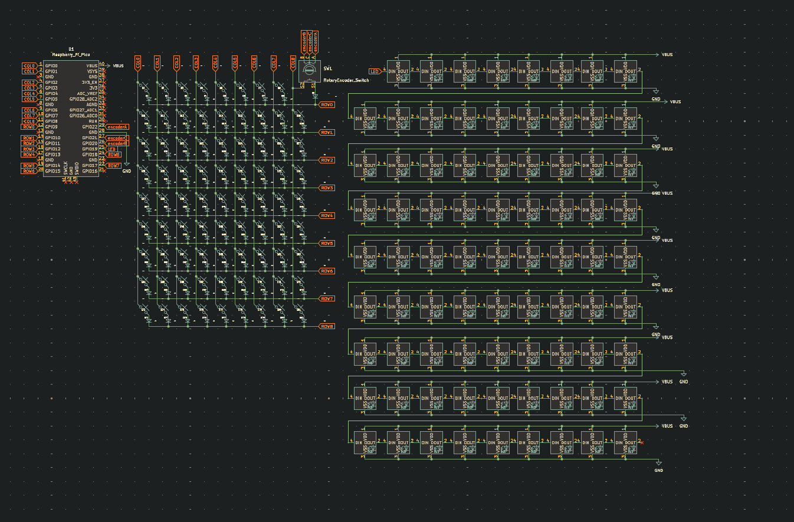
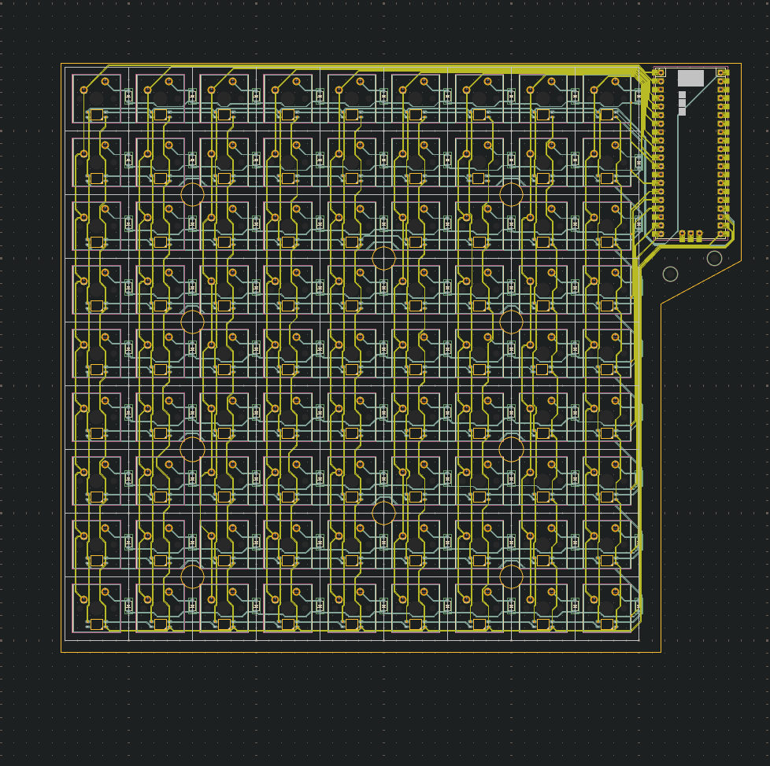
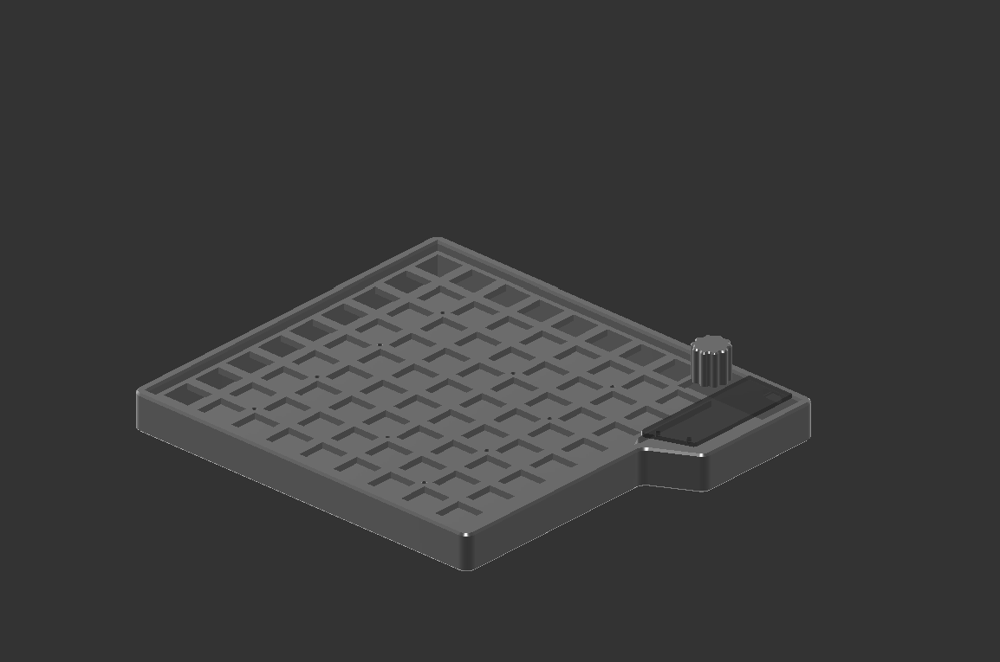
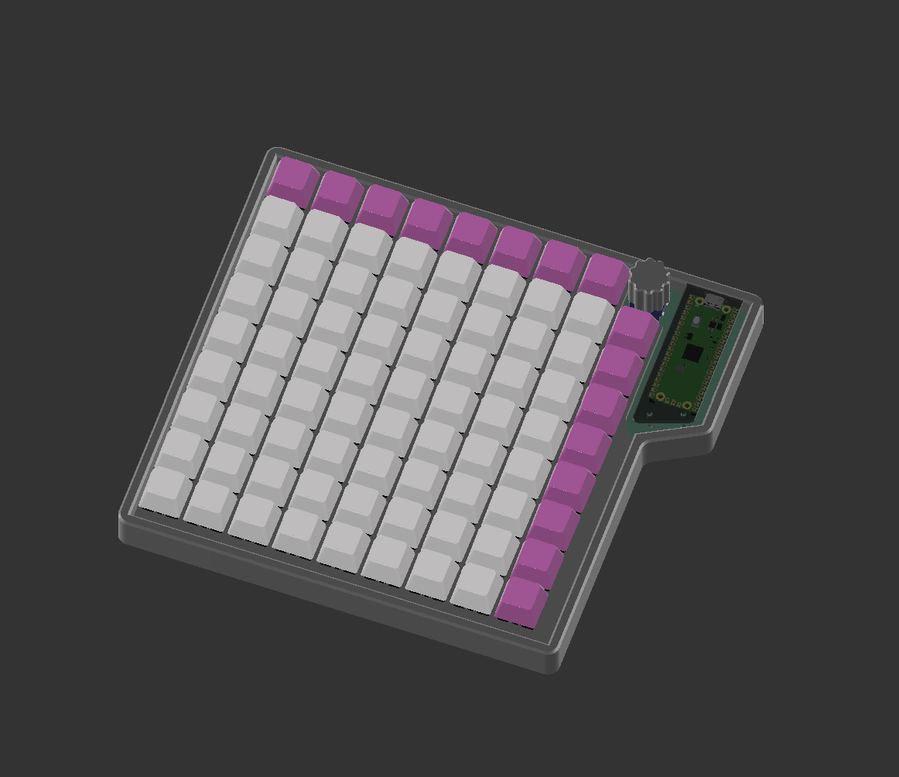
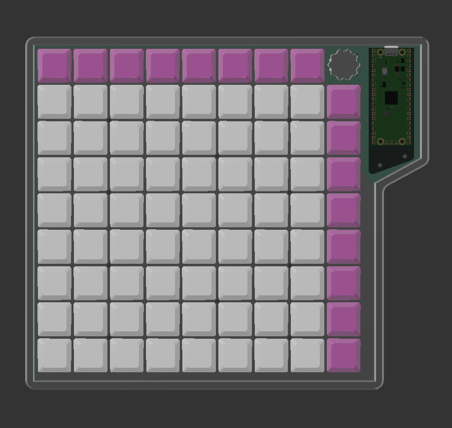
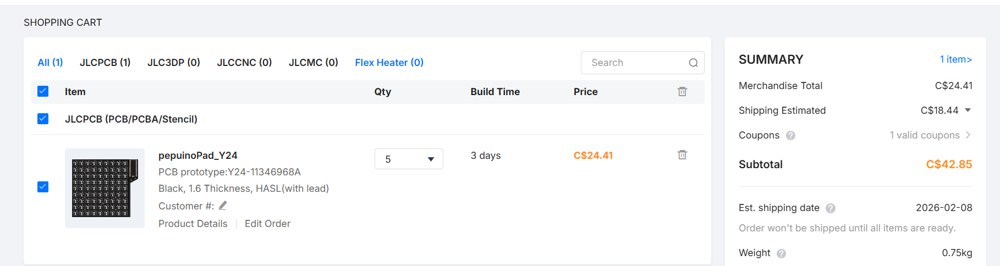

# Pepuino Pad

This is the pepuino pad, a 9 by 9 midi launchpad, with per key rgb illumination (the brightness can only be set to 30% ish) the pepuino pad is a midi compatible launchpad to make music, this project, the shematics and the pcb are made in kicad, and the case and render are made in fusion 360 and it uses the custom made pepuino nano V1 as the main microcontroler (microcontroller based on a rp2040 chip)

###  Shematic
 
### pcb
 
### case
 
### render
 
  

## BOM
 

## Components (KIT)

| Item | Description | Quantity | Unit Price | Total Price | URL |
|-----|------------|----------|------------|-------------|-----|
| Blank keycaps | White | 90 | 0,13 | 11,81 | https://www.aliexpress.com/item/32842379355.html |
| Blank keycaps | Green | 20 | 0,19 | 3,77 | https://www.aliexpress.com/item/1005006116865547.html |
| Switches | Mechanical switches | 90 | 0,23 | 20,31 | https://www.aliexpress.com/item/1005009787231480.html |
| Diodes | SMD diodes | 100 | 0,03 | 3,08 | https://www.aliexpress.com/item/1005007160563285.html |
| M2 standoff | M2 standoff 5mm | 50 | 0,05 | 2,47 | https://www.aliexpress.com/item/1005006049595637.html |
| M2 screw | 5mm screw | 50 | 0,03 | 1,65 | https://www.aliexpress.com/item/1005005070119421.html |
| LED | SK6812 | 100 | 0,07 | 6,67 | https://www.aliexpress.com/item/1005005193716172.html |
| Roraty encoder | ec11 | 1 | 1,85 | 1,85 | https://www.aliexpress.com/item/1005007644083514.html |
| Taxes | AliExpress tax | — | — | 4,28 | — |

**Components Subtotal:** **55,89**

---

## PCB

| Item | Description | Price |
|-----|------------|-------|
| JLCPCB | Pepuino Pad PCB | 24,41 |
| JLCPCB Shipping | PCB shipping + taxes | 18,44 |

---

## Total

| Description | Amount |
|------------|--------|
| **Grand Total** | **98.74** |

